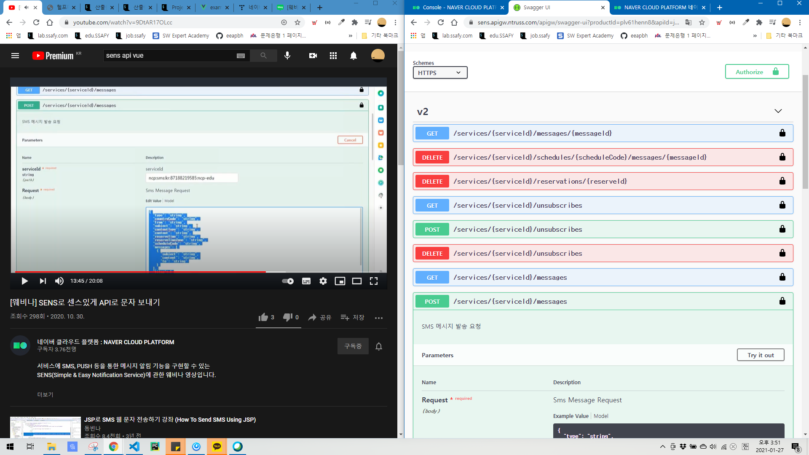

Vue 프로젝트에 Font Awesome 패키지 설치하기


```
$ yarn add -D @fortawesome/fontawesome-svg-core 
$ yarn add -D @fortawesome/free-solid-svg-icons 
$ yarn add -D @fortawesome/vue-fontawesome
```

기본적으로 `fontawesome-svg-core`와 `vue-fontawesome`는 반드시 설치를 해야 합니다.
`fontawesome-svg-core`는 Fontawesome의 SVG파일을 던져주는 역활을 하고 `vue-fontawesome`는 던져준 SVG파일을 Vue에서 사용할 수 있게 해주는 역활을 합니다.
`free-solid-svg-icons`는 아이콘의 모음이라고 보시면 됩니다. 만약 브랜드 로고 아이콘을 사용해야 한다면 `free-brands-svg-icons`도 설치해야 하는 식입니다.

아래는 **무료**로 사용할 수 있는 아이콘 파일 모음 입니다.

```
$ yarn add @fortawesome/free-solid-svg-icons 
$ yarn add @fortawesome/free-brands-svg-icons 
$ yarn add @fortawesome/free-regular-svg-icons
```


```
main.js
//fort-awesome
import { library } from '@fortawesome/fontawesome-svg-core'
import { faUserSecret } from '@fortawesome/free-solid-svg-icons'
import { FontAwesomeIcon } from '@fortawesome/vue-fontawesome'

library.add(faUserSecret)

Vue.component('font-awesome-icon', FontAwesomeIcon)

Vue.config.productionTip = false
```





```
<!--
    가입하기는 기본적인 폼만 제공됩니다
    기능명세에 따라 개발을 진행하세요.
    Sub PJT I에서는 UX, 디자인 등을 포함하여 백엔드를 제외하여 개발합니다.
 -->
<template>
  <div class="user join wrapC">
    <Header />
    <h1>가입하기</h1>
    <div class="form-wrap">
      <div class="input-with-label">
        <input
          v-model="name"
          v-bind:class="{
            error: error.name,
          }"
          id="name"
          placeholder="이름을 입력하세요."
          type="text"
        />
        <label for="name">이름</label>
        <div class="error-text" v-if="error.name">
          {{ error.name }}
        </div>
      </div>

      <div class="input-with-label">
        <input
          v-model="email"
          v-bind:class="{
            error: error.email,
          }"
          id="email"
          placeholder="이메일을 입력하세요."
          type="text"
        />
        <label for="email">이메일</label>
        <div class="error-text" v-if="error.email">{{ error.email }}</div>
      </div>
      <div class="input-with-label">
        <input
          v-model="password"
          type="password"
          v-bind:class="{
            error: error.password,
          }"
          id="password-confirm"
          placeholder="비밀번호를 입력하세요."
        />
        <label for="password-confirm">비밀번호</label>
        <div class="error-text" v-if="error.password">
          {{ error.password }}
        </div>
      </div>
      <div class="input-with-label" style="margin-bottom:50px">
        <input
          v-model="passwordConfirm"
          type="password"
          v-bind:class="{
            error: error.passwordConfirm,
          }"
          id="password-confirm"
          placeholder="비밀번호를 다시한번 입력하세요."
        />
        <label for="password-confirm">비밀번호 확인</label>
        <div class="error-text" v-if="error.passwordConfirm">
          {{ error.passwordConfirm }}
        </div>
      </div>
      <h3>휴대전화 인증</h3>
      <div class="input-with-label">
        <div class="phoneContainer" style="display:flex; align-content:center">
          <input
            v-model="phone"
            type="text"
            v-bind:class="{
              error: error.phone,
            }"
            id="phone"
            placeholder="-없이 숫자만 입력"
          />
          <label for="phone">휴대전화</label>

          <b-button squared variant="primary">
            인증번호받기
          </b-button>
        </div>
        <div class="error-text" v-if="error.phone">
          {{ error.phone }}
        </div>
      </div>

      <div class="input-with-label">
        <div
          class="phoneConfirmContainer"
          style="display:flex; align-content:center;"
        >
          <input
            v-model="phoneConfirm"
            type="text"
            v-bind:class="{
              error: error.phoneConfirm,
            }"
            id="phoneConfirm"
            placeholder="인증번호"
          />
          <label for="phoneConfirm">인증번호입력</label>

          <b-button squared variant="primary" style="width:180px">
            인증하기
          </b-button>
        </div>
        <div class="error-text" v-if="error.phoneConfirm">
          {{ error.phoneConfirm }}
        </div>
      </div>
    </div>

    <label>
      <input v-model="isTerm" type="checkbox" id="term" />
      <span>약관을 동의합니다.</span>
    </label>

    <span @click="termPopup = true">약관보기</span>

    <button class="btn-bottom" @click="onJoin" :disabled="!isSubmit">
      가입하기
    </button>
  </div>
</template>

<script>
import "../../components/css/user.scss";
import axios from "axios";
import * as EmailValidator from "email-validator";
import PV from "password-validator";
import Header from "../../components/common/Header.vue";

export default {
  components: {
    Header,
  },
  created() {
    this.passwordSchema
      .is()
      .min(8)
      .is()
      .max(100)
      .has()
      .digits()
      .has()
      .letters();
  },
  data() {
    return {
      email: "",
      password: "",
      passwordSchema: new PV(),
      passwordConfirm: "",
      name: "",
      phone: "",
      phoneConfirm: "",
      isnameWritten: false,
      isTerm: false,
      error: {
        email: false,
        password: false,
        name: false,
        passwordConfirm: false,
        phone: false,
        phoneConfirm: false,
      },
      isSubmit: false,
      termPopup: false,
    };
  },
  watch: {
    name: function(v) {
      this.isnameWritten = true;
      this.checkForm();
      this.checkComplete();
    },
    password: function(v) {
      this.checkForm();
      this.checkComplete();
    },
    email: function(v) {
      this.checkForm();
      this.checkComplete();
    },
    passwordConfirm: function(v) {
      this.checkForm();
      this.checkComplete();
    },
    phone: function(v) {
      this.checkForm();
      this.checkComplete();
    },
    phoneConfirm: function(v) {
      this.checkForm();
      this.checkComplete();
    },
    isTerm: function(v) {
      this.checkComplete();
    },
  },
  methods: {
    checkForm() {
      if (this.isnameWritten) {
        if (this.name.length == 0) this.error.name = "이름을 입력해주세요.";
        else this.error.name = false;
      }

      if (this.email.length > 0 && !EmailValidator.validate(this.email))
        this.error.email = "이메일 형식이 아닙니다.";
      else this.error.email = false;

      if (
        this.password.length > 0 &&
        !this.passwordSchema.validate(this.password)
      )
        this.error.password = "영문, 숫자 포함 8자리 이상이어야 합니다.";
      else this.error.password = false;

      if (
        this.passwordConfirm.length > 0 &&
        this.password != this.passwordConfirm
      )
        this.error.passwordConfirm = "비밀번호가 일치하지 않습니다.";
      else this.error.passwordConfirm = false;

      if (this.phone.length > 0 && this.phone.length < 11)
        this.error.phone = "휴대전화 양식이 아닙니다";
      else this.error.phone = false;

      if (this.phoneConfirm.length > 0 && this.phoneConfirm.length < 6)
        this.error.phoneConfirm = "인증번호 6자리입력해주세요";
      else this.error.phoneConfirm = false;
    },
    onJoin() {
      if (this.isSubmit) {
        var emailLowercase = this.email.toLowerCase();
        var userInfo = {
          uno: "",
          email: emailLowercase,
          uname: this.name,
          password: this.password,
          tel: this.phone,
          createDate: "",
          uprofileImg: "",
        };

        //요청 후에는 버튼 비활성화
        this.isSubmit = false;

        axios
          .post("http://localhost:8080/join", userInfo)
          .then((resp) => {
            alert("회원가입이 완료되었습니다.");
            this.$router.push("/");
            console.log(resp);
          })
          .catch((err) => {
            alert("회원가입 도중 오류가 발생하였습니다.");
            console.log(err);
          });
      }
    },
    checkComplete() {
      if (
        this.name.length > 0 &&
        this.password.length > 0 &&
        this.passwordConfirm.length > 0 &&
        this.email.length > 0 &&
        this.phone.length > 0 &&
        this.phoneConfirm.length > 0 &&
        this.isTerm
      ) {
        let isSubmit = true;

        Object.values(this.error).map((v) => {
          if (v) isSubmit = false;
        });

        this.isSubmit = isSubmit;
      }
    },
  },
};
</script>

```

